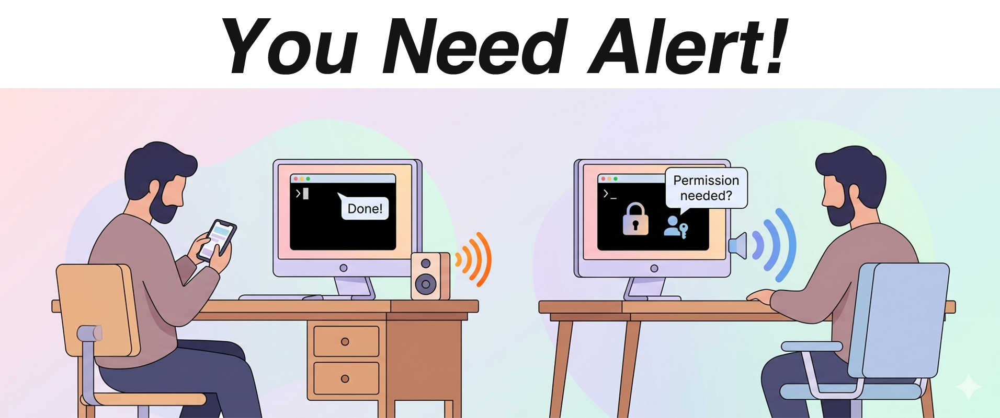
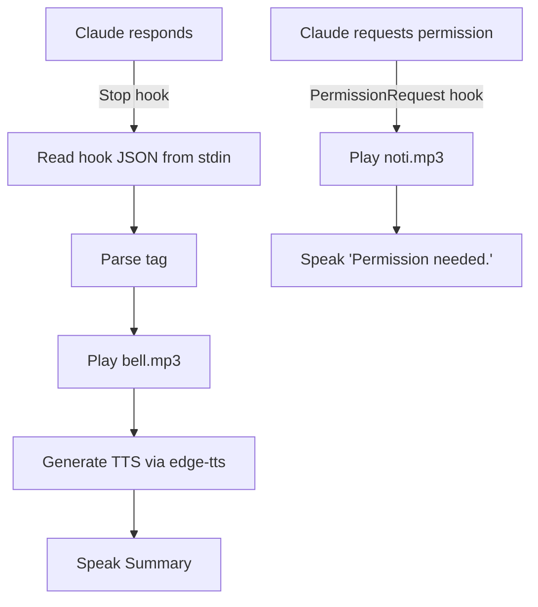

# claude-code-alert


**Never miss when Claude Code needs you.** Get audio notifications with text-to-speech when Claude finishes a task or asks for permission.

Works on macOS, Windows, and Linux.

## Why?



Claude Code runs in your terminal. You tab away, start reading docs, grab coffee -- and miss that Claude finished 2 minutes ago. Or worse, Claude's been waiting for your permission to proceed.

**claude-code-alert** plays a distinct sound + speaks a summary so you always know what's happening, even from across the room.

| Event | Sound | What you hear |
|---|---|---|
| Task completed | `bell.mp3` | *"Done. Added the permission request hook."* |
| Permission needed | `noti.mp3` | *"Permission needed."* |

## Setup

Ask Claude: 
```
Setup this hook: https://github.com/sangwonme/ClaudeCode-Alert-Hook.git
```

That's it. Claude handles the rest.

## How It Works



## File Structure

```
claudecodealert/
  scripts/
    alert.py              # Main script
  sounds/
    bell.mp3              # Task completion chime
    noti.mp3              # Permission request chime
  README.md
  SETUP.md                # Setup guide (for you or Claude to follow)
```

## Requirements

- Python 3.8+
- [`edge-tts`](https://pypi.org/project/edge-tts/) (free, uses Microsoft Edge's online TTS)
- Internet connection (for TTS generation)
- Audio playback: `afplay` (macOS), PowerShell (Windows), or `mpv` (Linux)

## Troubleshooting

| Symptom | Fix |
|---|---|
| No sound at all | Check that `python` is on PATH and `edge-tts` is installed: `python -c "import edge_tts"` |
| Chime plays but no speech | Check `scripts/alert_debug.json` for `TTS_ERROR`. Usually a network issue. |
| Generic "Task completed" | Claude didn't include the `<!-- tts: ... -->` tag. Check your `CLAUDE.md`. |
| Hook timeout | Increase `"timeout"` in settings.json (default 30s). |

## Customization

Edit the constants at the top of `alert.py`:

```python
VOICE = "en-GB-SoniaNeural"   # Any edge-tts voice
RATE = "+30%"                  # Speech rate
```

To list available voices: `edge-tts --list-voices`
- Or visit [EdgeTTS voice list](https://tts.travisvn.com/)

## License

MIT
